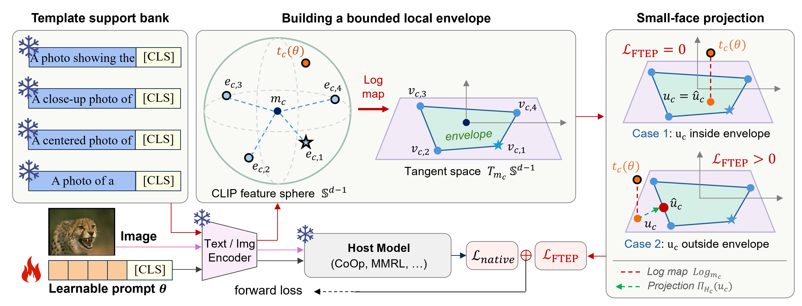

# Frozen Template Envelope Projection for Vision-Language Prompt Tuning


> Haoyang Li<sup>1,2</sup>, Liang Wang<sup>1,2</sup>, Chao Wang<sup>2</sup> and Yan Peng<sup>2</sup>. <br>
> _<sup>1</sup>University of Technology Sydney &emsp; <sup>2</sup>Shanghai University_     <br>
> 
> _*This paper is submitted to **The Visual Computer** journal._

<hr />


### 📜 Abstract
Prompt tuning is widely studied for its ability to rapidly adapt pretrained vision-language models (VLMs, represented by CLIP) to downstream tasks by optimizing only a small set of learnable prompts while keeping the pretrained encoders frozen. However, adaptation on target (**base**) tasks often overfits the target distribution and degrades generalization to unseen (**new**) classes, leading to the Base-New Trade-off problem. Among existing solutions, a common strategy is to use a hand-crafted prompt template as a single-point reference to prevent the optimization direction of text features learned from learnable prompts from deviating excessively from the pretrained CLIP prior. However, semantically valid prompt templates allow diverse expressions that occupy nearby but distinct locations in CLIP feature space, so a single-point constraint can suppress shifts of learnable prompts toward other valid feature variations that are close to the prompt template. To reduce this over-constraint, we propose **F**rozen **T**emplate **E**nvelope **P**rojection (**FTEP**), which extends the single-point reference to an envelope spanned by multiple valid frozen prompts and constructs an admissible region that preserves supported prompt variation while restricting excessive deviation. Specifically, FTEP introduces a template support bank, builds a bounded local envelope in common tangent coordinates, and applies small-face projection to regularize features outside this region. Experiments across multiple host models and 11 datasets show that FTEP provides plug-and-play improvements in both base-class performance and new-class generalization across diverse prompt tuning hosts.


### 🔍 Framework

<div style="text-align:center"></div>

<figcaption class="content has-text-left"  style="word-break:normal">
Figure 1. Overview of FTEP. <em><strong>Template support bank</em></strong> encodes K=4 frozen class templates. Their normalized CLIP features and the tuned feature are mapped to a shared tangent space, where frozen coordinates form the <em><strong> convex envelope</em></strong> H_c. <em><strong>Small-face projection</em></strong> maps u_c to the nearest admissible point, yielding zero/positive loss inside/outside H_c.
</figcaption></p>


### 📄 Core Files of FTEP

- `trainers/mmrl.py` - multimodal representation learner (existing host model as a baseline);
- `trainers/ftep_mmrl.py` - FTEP envelope projection based on MMRL host;
- `configs/trainers/<algorithm_name>` - detailed fine-tuning hyperparameter settings of MMRL & FTEP;
- `configs/datasets` - the 11 standard prompt tuning datasets.

### ⚙️ Running

1. Create the environment and install Dassl.pytorch library. 
        <br> Please follow the instructions detailed in [INSTALL.md](docs/INSTALL.md).
2. Prepare the dataset. We release 11 prompt tuning datasets on [[🤗HuggingFace](https://huggingface.co/datasets/JREion/Prompt_Tuning_Datasets_with_Foreground)].
       <br> Details of data preparation can be found in [DATASETS.md](docs/DATASETS.md).
       <br> You can use the helper `scripts/link_datasets.ps1` to create junction links only.
3. Run fine-tuning script on the host model first (e.g., FGVCAircraft dataset):

    ```powershell
    python -u scripts/run_base_to_new.py --methods MMRL --datasets fgvc_aircraft --seeds 1 2 3 --shots 16 --phase base
    python -u scripts/run_base_to_new.py --methods MMRL --datasets fgvc_aircraft --seeds 1 2 3 --shots 16 --phase new
    ```
4. Run fine-tuning script on the FTEP based on the above host model:

    ```powershell
    python -u scripts/run_base_to_new.py --methods FTEP_MMRL --datasets fgvc_aircraft --seeds 1 2 3 --shots 16 --phase base
    python -u scripts/run_base_to_new.py --methods FTEP_MMRL --datasets fgvc_aircraft --seeds 1 2 3 --shots 16 --phase new
    ```
5. Summarize results

    ```powershell
    python -u scripts/summarize_base_to_new.py --output-root output --results-root results
    ```

    This script writes `results/base_to_new_summary.csv` and `results/report.md`.


### 💡 Our previous work on prompt tuning

- **[CVPR 25] [DPC: Dual-Prompt Collaboration for Tuning Vision-Language Models](https://openaccess.thecvf.com/content/CVPR2025/html/Li_DPC_Dual-Prompt_Collaboration_for_Tuning_Vision-Language_Models_CVPR_2025_paper.html)**    
_**Haoyang Li**, Liang Wang, Chao Wang, Jing Jiang, Yan Peng and Guodong Long._

- **[ICME 25] [MAO: Efficient Model-Agnostic Optimization of Prompt Tuning for Vision-Language Models](https://arxiv.org/abs/2503.18160)**    
_**Haoyang Li**, Siyu Zhou, Liang Wang and Guodong Long._ 

- **[Knowledge-Based Systems] [Negative-Sampling prompt learning for hard negative sample discrimination](https://www.sciencedirect.com/science/article/abs/pii/S0950705126003436)**    
_**Haoyang Li**, Liang Wang, Chao Wang and Yan Peng._

## Acknowledgements

Our code is based on [CoOp](https://github.com/KaiyangZhou/CoOp), [DePT](https://github.com/Koorye/DePT), [MMRL](https://github.com/yunncheng/MMRL) and [FVG-PT](https://github.com/JREion/FVG-PT) repository. We thank the authors for releasing their code.
